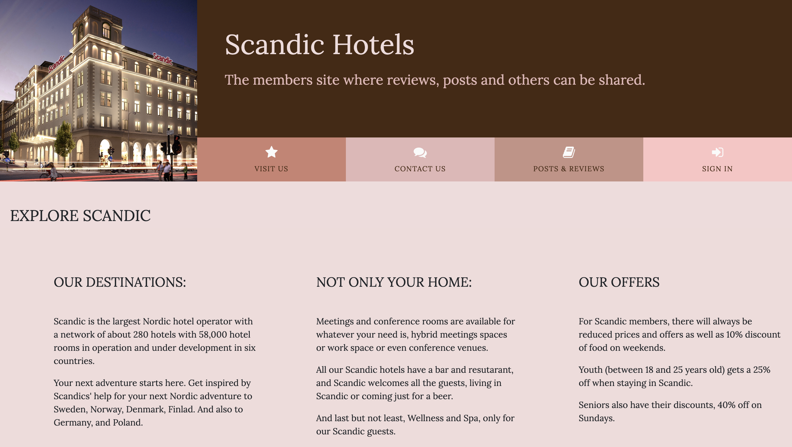
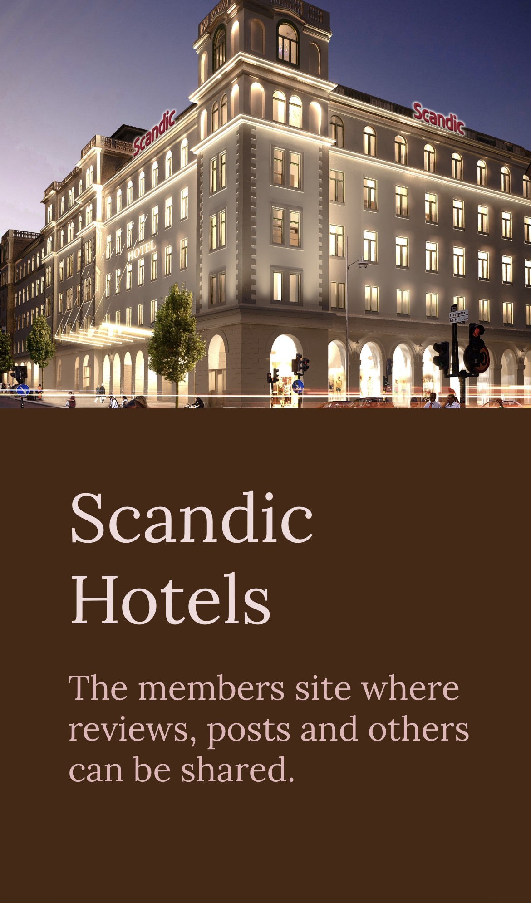
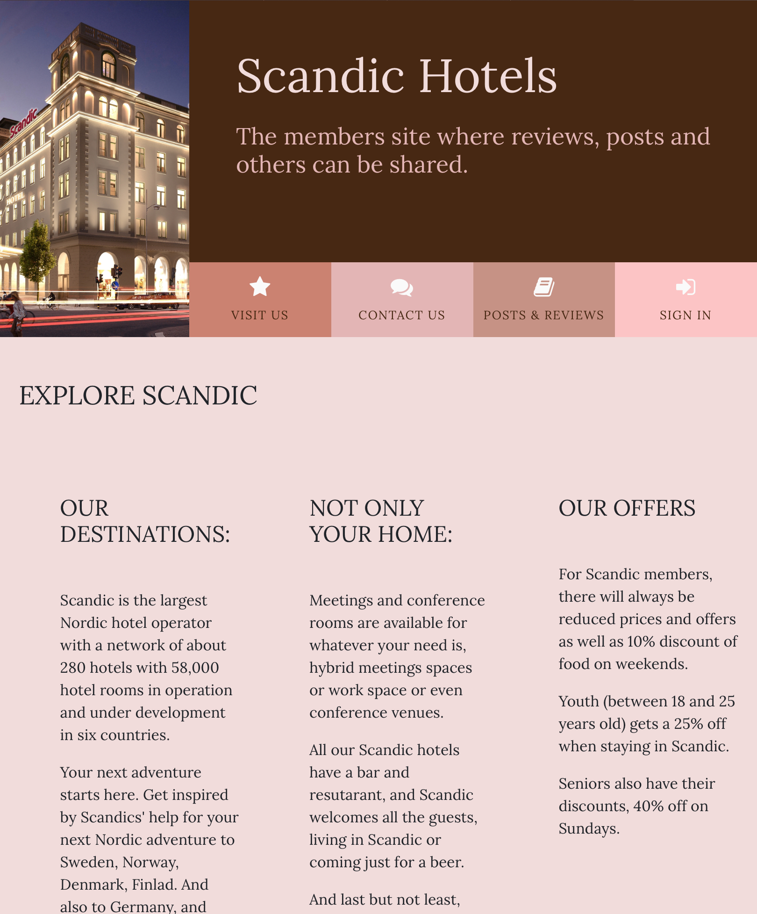
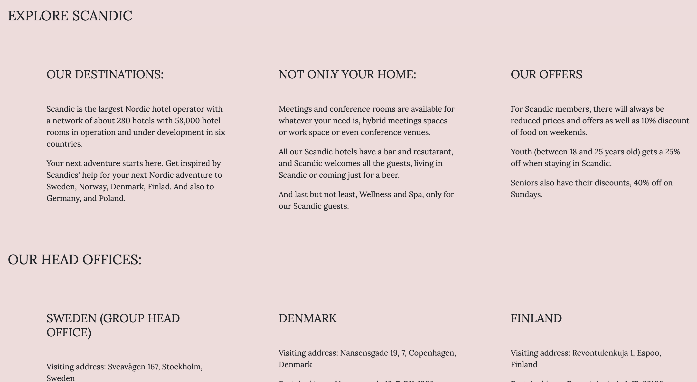
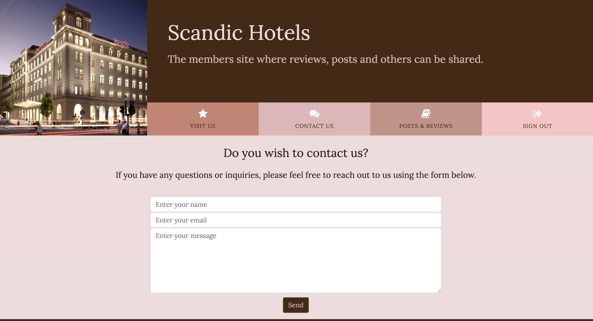
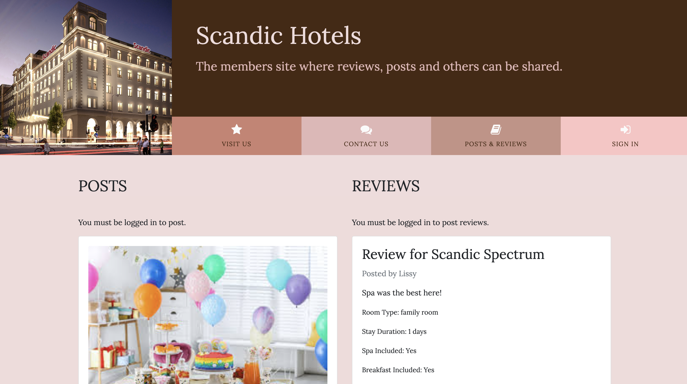
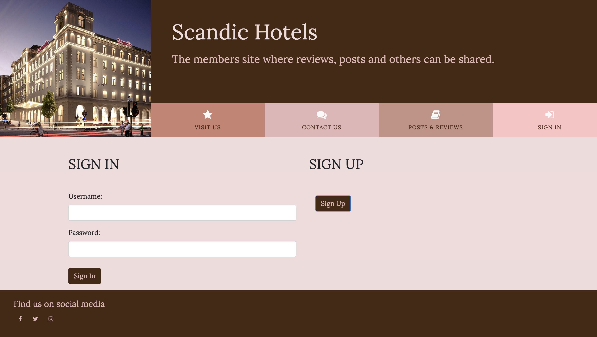
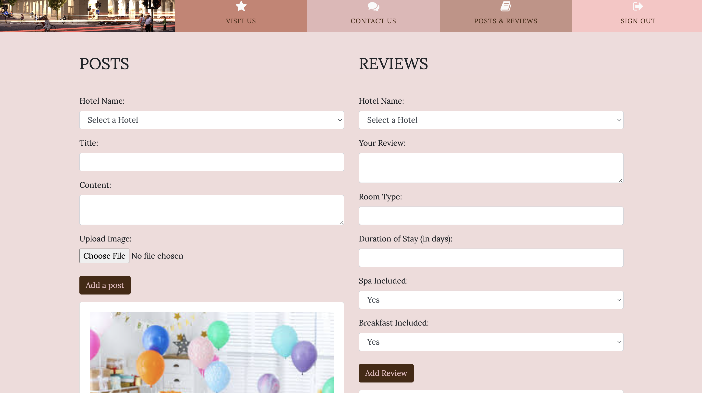
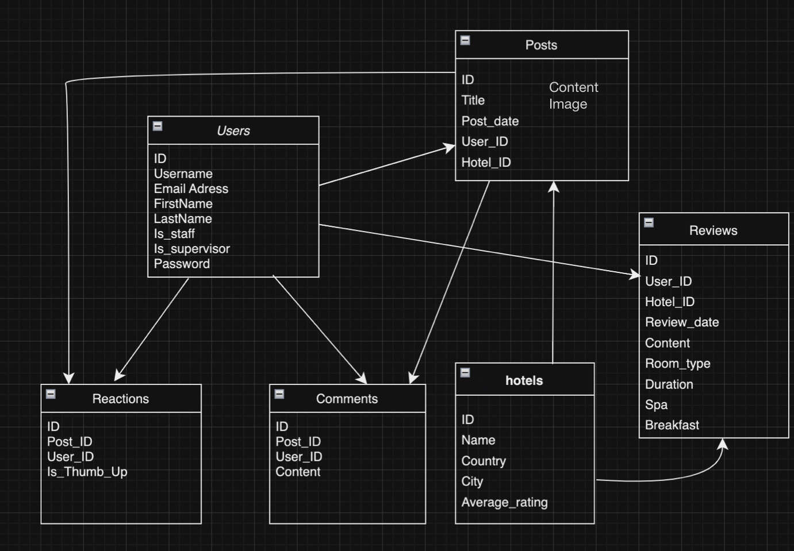

# Scandic Hotels

## Scandic Hotels Members Site

 Scandic Hotels Members Site is an interactive platform designed for the vibrant community of Scandic Hotels' guests. This website is a hub where members can sign in, share their experiences, post reviews, and engage with others' content. Our primary goal is to create a dynamic environment where members can connect, exchange their hotel experiences, and provide valuable feedback in a friendly and welcoming online space. Targeted towards travelers, hotel enthusiasts, and Scandic Hotel guests, this platform aims to enhance the overall guest experience by encouraging a communal exchange of stories, tips, and reviews.

### Features

#### Responsive Design:
The site is fully responsive and provides a seamless experience on various devices and screen sizes as seen in the picture above.

Since ami.responsive was down trying to test the wesbite, i will add 3 different photos of different devices; laptop, ipad and iphone

#### Existing Features:
Navigation Bar: 
Present on all pages for ease of navigation.
Includes links to Home, Posts&Reviews, Contact, and Sign-in/Sign-up pages.

#### Home page:
General information about the hotel will be displayed here as well as information about the offices.

#### Contact Section:
A dedicated area for users to reach out for support or inquiries, fostering better communication between the members and the hotel management.

#### Posts and Reviews Sections:
Members can create, view, and interact with posts and create hotel reviews.

Each post is equipped with engagement features like comments and reactions as well as the ability of posting an image.

#### Authentication System:
Allows users to sign up, sign in, interact in posts and posting reviews.
Ensures a personalized and secure experience for each member.

After signing up, the members will be able to take a part the website.

#### Additional Planned Features:
Integration of a live chat system for real-time interactions.

#### Database planner.
I used draw.io for planning how my database tables will be and how will they be connected to each other.

### Testing
#### Validator Testing
No errors when the code was passed through the W3C validator, Jigsaw validator, and the Jshint validator

Browser Compatibility
Tested across multiple browsers (Chrome, Firefox, Safari) and devices for consistency.

### Deployment
The site was deployed to Heroku. The steps to deploy are as follows:

In the Heroku dashboard, create a new app and set the necessary config vars.
Connect the Heroku app to the corresponding GitHub repository.
Enable automatic deploys from the main branch and deploy the app.
Access the live site via the provided Heroku link.

### Credits
Content
All credits go to the teachers making the video contents and insperation for ideas, and to the tutor Oisin for helping the deployment issues that took me long time to fix.

### Media
Images for the hotel galleries were sourced from google.

